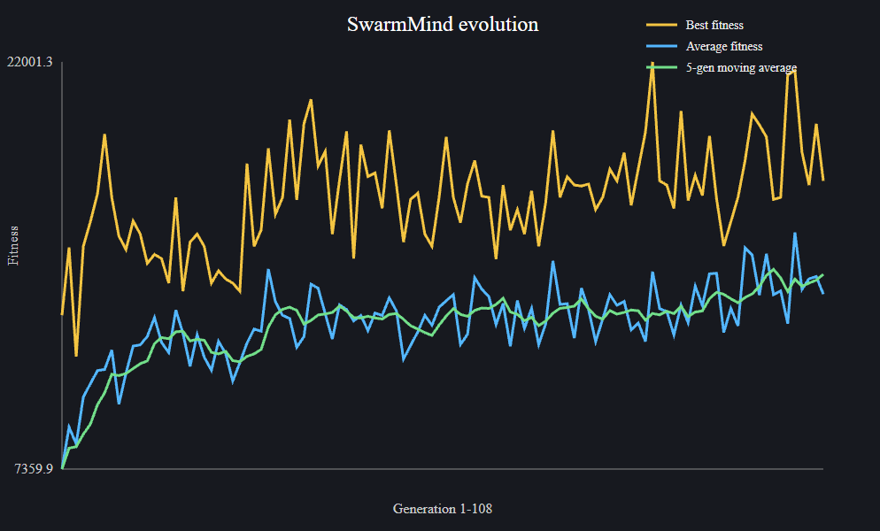

# SwarmMind

SwarmMind is an experimental artificial-life simulation written in C++20. Each agent is controlled by a small neural network, and behavior evolves through survival, reproduction, crossover, mutation, and generation-level selection.

The project explores a simple question:

> Can useful behavior emerge from evolution and environmental pressure instead of being explicitly programmed?

SwarmMind is currently an early-stage research and learning project. The simulation works, produces measurable evolutionary trends, and is under active development.



The example above shows one simulation run across 108 generations. Best fitness is shown in yellow, average fitness in blue, and the five-generation moving average in green. The smoother upward trend illustrates how successful behavior can gradually spread through the population despite substantial variation between individual generations.

## What the simulation contains

- Autonomous neural-network-controlled agents
- Food that restores energy and respawns over time
- Threats that damage nearby agents
- Energy, health, aging, starvation, and death
- Sensor-limited perception of nearby food and threats
- Reproduction through neural-network crossover and mutation
- Fitness-based selection between generations
- Elitism that preserves the strongest brains
- CSV statistics and SVG fitness graphs
- Real-time visualization with SFML

## Visualization

The simulation uses a `1200 x 800` wraparound world:

| Color | Meaning |
| --- | --- |
| White | Agent |
| Yellow | Agent currently detecting a threat |
| Green | Food |
| Red | Threat |
| Gray circle | Agent vision radius |

Objects leaving one side of the world re-enter from the opposite side.

## Agent brain

Every agent has its own feedforward neural network:

```text
6 inputs -> 8 hidden neurons -> 2 outputs
```

Both layers use `tanh` activation functions and include biases.

### Inputs

The six normalized inputs are:

1. Food direction X
2. Food direction Y
3. Threat direction X
4. Threat direction Y
5. Energy
6. Health

The sensor system selects the nearest visible food source and nearest visible threat within a radius of 65 units. Direction vectors are normalized, while energy and health are mapped approximately to `[-1, 1]`.

When no food is visible, an agent uses a periodically changing wander direction. An absent threat is represented by a neutral `(0, 0)` vector.

### Outputs

The two outputs directly control movement along the X and Y axes.

There is no hardcoded instruction telling an agent to seek food or avoid threats. Evolution must discover weights that turn sensory input into useful movement.

## Life cycle

Agents begin with full energy and health. During the simulation:

- Energy decreases over time.
- Eating food restores energy.
- When energy reaches zero, health begins to decrease.
- Contact with a threat causes damage over time.
- An agent dies when its health reaches zero.
- Healthy, energetic agents that are close together can reproduce.

During reproduction, both parents contribute neural-network weights and biases through uniform crossover. Random mutation then introduces new variation.

## Fitness and evolution

An agent's fitness is calculated as:

```text
fitness = age + (food eaten * 50) + (children produced * 100)
```

When the population becomes extinct, all archived agents are ranked by fitness and a new population of 12 agents is created.

The current generation strategy is:

- The two strongest brains are copied unchanged into the next generation.
- Remaining parents are selected using fitness-proportional selection.
- Half of the non-elite offspring receive low mutation:
  - Probability: `2%` per weight or bias
  - Maximum magnitude: `0.05`
- The other half receive higher mutation:
  - Probability: `8%` per weight or bias
  - Maximum magnitude: `0.15`

This balances exploitation of successful behavior with continued exploration of new behavior.

## Statistics

At the end of each generation, SwarmMind appends data to:

```text
generation_stats_v3.csv
```

The file includes:

- Agents evaluated
- Best and average fitness
- Fitness standard deviation
- Change in average fitness
- Five-generation moving average
- Average age
- Total food eaten
- Average food per agent
- Offspring created

Generated CSV and SVG files are intentionally ignored by Git.

### Generate a graph

The included Python script converts the CSV statistics into an SVG graph:

```powershell
python .\tools\plot_generation_stats.py
```

If the executable writes its CSV file inside `build`, run the script from that directory:

```powershell
cd build
python ..\tools\plot_generation_stats.py
```

This creates:

```text
generation_stats.svg
```

The graph displays best fitness, average fitness, and the five-generation moving average.

## Requirements

- A C++20-compatible compiler
- CMake 3.16 or newer
- SFML 2.6 with the `graphics`, `window`, and `system` components
- Python 3, only for generating statistics graphs

The project is currently developed and tested on Windows with MinGW-w64 and SFML 2.6.1.

## Build and run

The `CMakeLists.txt` file is located in `src`.

### Windows with MinGW

From the repository root:

```powershell
cmake -S src -B build -G "MinGW Makefiles"
cmake --build build -j
.\build\SwarmMind.exe
```

If CMake cannot locate SFML, provide its CMake package directory:

```powershell
cmake -S src -B build -G "MinGW Makefiles" `
  -DSFML_DIR="C:\path\to\SFML\lib\cmake\SFML"
```

### Generic CMake workflow

```bash
cmake -S src -B build
cmake --build build
```

Run the resulting `SwarmMind` executable from the directory where you want the CSV statistics to be created.

## Project structure

```text
SwarmMind/
|-- src/
|   |-- Agent.*            Agent state, neural inputs, movement, and fitness
|   |-- NeuralNetwork.*    Feedforward neural network implementation
|   |-- SystemSensors.*    Food and threat perception
|   |-- World.*            Environment, reproduction, selection, and statistics
|   |-- Simulation.*       Simulation wrapper
|   |-- main.cpp           SFML window and rendering loop
|   `-- CMakeLists.txt
|-- tools/
|   `-- plot_generation_stats.py
|-- .gitignore
`-- README.md
```
